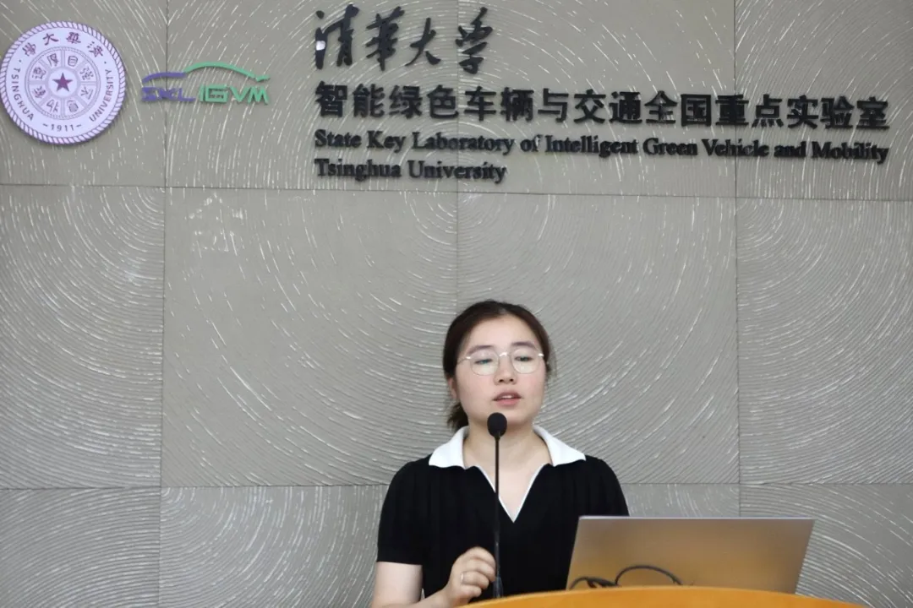
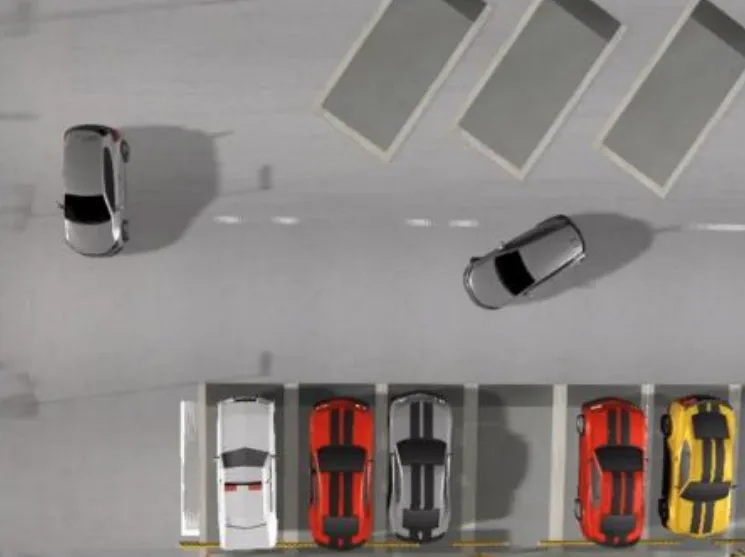

The defense presentation for the 3rd OnSite Autonomous Driving Algorithm Challenge was recently held in Beijing. The AWESOME team from Shanghai Jiao Tong University, mentored by Associate Professor Yunwen Xu from the School of Automation and Perception, won first place in the parking track. The team, consisting of graduate student Zhang Yifan and undergraduate students Yu Haoran and He Zile, demonstrated exceptional technical prowess through multiple rounds of online algorithm testing and offline defense presentations.

## Project Highlights

Automated Valet Parking (AVP), as a typical L4 autonomous driving application scenario, effectively addresses urban parking challenges through autonomous parking space search and precise parking. The Onsite track deeply recreates typical urban parking scenarios, featuring various parking spaces, dynamic obstacles, and cross-floor navigation, simulating extreme parking conditions to verify algorithm robustness and adaptability. The parking track attracted 50 teams from 28 universities, completing 62,200 scenario tests, averaging approximately 1,200 tests per team.

## Technical Innovation

The AWESOME team developed innovative solutions for the competition scenarios:
- An efficient multi-stage parking trajectory generation method based on human-like parking planners
- A collaborative obstacle avoidance trajectory planning method combining global trajectory guidance with local rolling optimization

The team completed all 310 test cases on the Onsite autonomous driving testing platform, including:
- Dead-end road scenarios
- Narrow space scenarios
- Deep parking spots and other extreme conditions

Under a comprehensive evaluation system considering efficiency, safety, accuracy, and success rate, the team won first place in the online track with a significant advantage and excelled in the offline defense presentation, ultimately securing the championship in the parking track.

## About the Competition

The 3rd OnSite Autonomous Driving Algorithm Challenge was held under the guidance of the Department of Engineering and Materials Science of the National Natural Science Foundation of China and the China Society of Automotive Engineers. It was hosted by Tongji University and the National Innovation Center of Intelligent and Connected Vehicles, with co-organization from Zhejiang University, Shanghai Jiao Tong University, Tsinghua University, and Wuhan University of Technology. The competition focused on AI-driven autonomous driving technology development with seven online tracks.

Since its launch in March 2025, the competition scale includes:
- 90 universities from China and abroad
- 418 participating teams
- 873 contestants
- Over 2,000 algorithm updates
- More than 1.5 million autonomous driving algorithm tests 