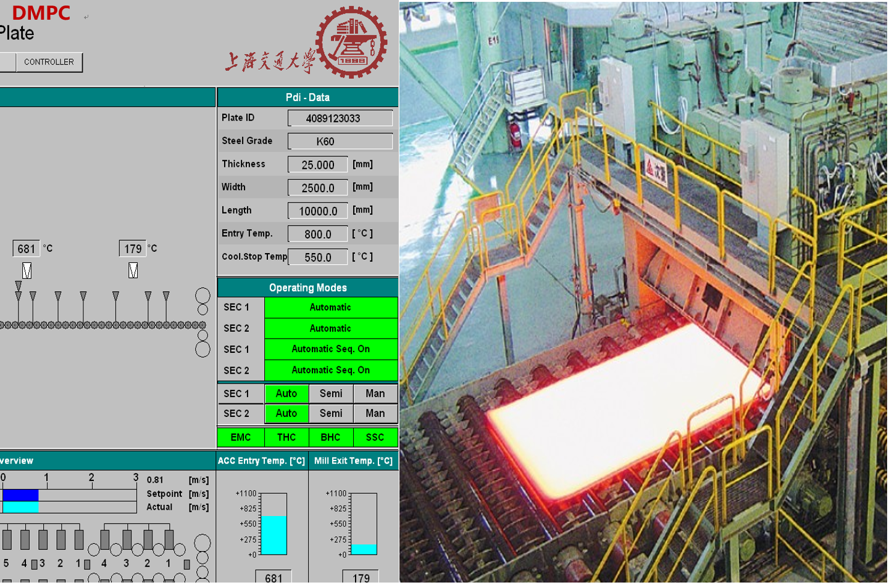
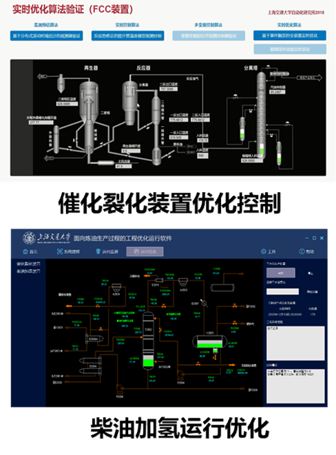

Focused on energy optimization in large-scale industrial systems:

**Heavy Plate Cooling Control:**

* Increased temperature qualification rates from 60% to 85%.
* Improved product yield from 180 tons/hour to 210 tons/hour.

  

**Light Oil Yield in Petrochemical Systems:**

* Enhanced yield by 0.49%.
* Reduced comprehensive energy consumption to below 70 kg of standard coal per ton of output.

  

**Key Achievements:**

* Improved system stability and energy efficiency across diverse industrial processes.
* Implemented advanced diagnostics to reduce wastage and enhance process control.
