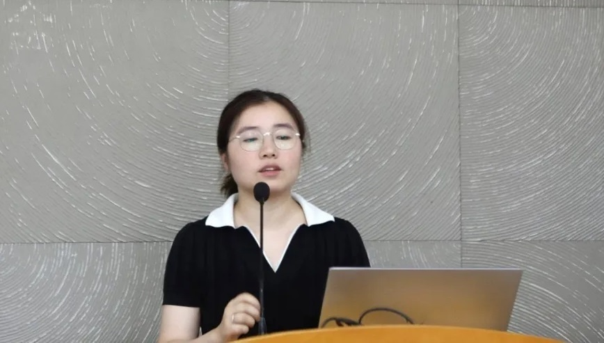
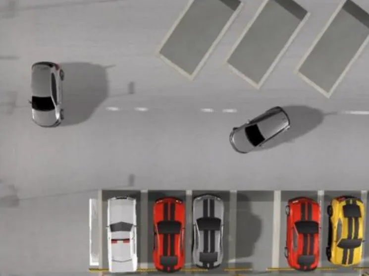

近日，第三届OnSite自动驾驶算法挑战赛答辩会在北京举行。上海交通大学自动化与感知学院徐云雯副研究员指导的AWESOME团队（研究生张一帆，本科生余浩然、何子乐）凭借出色的技术实力，历经线上多轮算法测试和线下答辩，在泊车赛道中斩获第一名。

## 项目亮点

自主代客泊车（AVP）作为L4级智能驾驶的典型应用场景，通过车辆自主完成停车位搜索与精准泊入，可以有效缓解城市停车难题。Onsite赛道深度还原城市停车场典型场景，设置覆盖不同的泊车车位、动态障碍物、跨楼层导航等场景，模拟真实泊车一些极端条件，验证算法鲁棒性与普适性。本届比赛泊车赛道共吸引28所高校50支团队参与，完成62200次场景测试，平均每支团队约1200次。

## 技术创新

AWESOME团队针对比赛的测试场景，开发了创新性的解决方案：
- 基于仿人入库规划器的多阶段泊车轨迹高效生成方法
- 全局轨迹引导-局部滚动优化的协同式避障轨迹规划方法

团队在Onsite自动驾驶测试平台上完成了全部310道测试题，包括：
- 断头路场景
- 狭窄空间场景
- 深度车位等极端条件

在综合考虑效率、安全、准确性、成功率的评价体系下，团队以明显优势夺得线上赛道第一名，并在线下答辩环节中表现优异，最终获得泊车赛道总冠军。

## 关于比赛

第三届OnSite自动驾驶算法挑战赛在国家自然科学基金委员会工程与材料科学部、中国汽车工程学会指导下举办，由同济大学、国家智能网联汽车创新中心主办，浙江大学、上海交通大学、清华大学、武汉理工大学共同协办。本届赛事聚焦AI驱动的自动驾驶技术发展，设置七大线上赛道。

自2025年3月开赛以来，比赛规模：
- 90所国内外高校参与
- 418个参赛团队
- 873名参赛选手
- 2000余次算法更新
- 超过150万次自动驾驶算法测试 